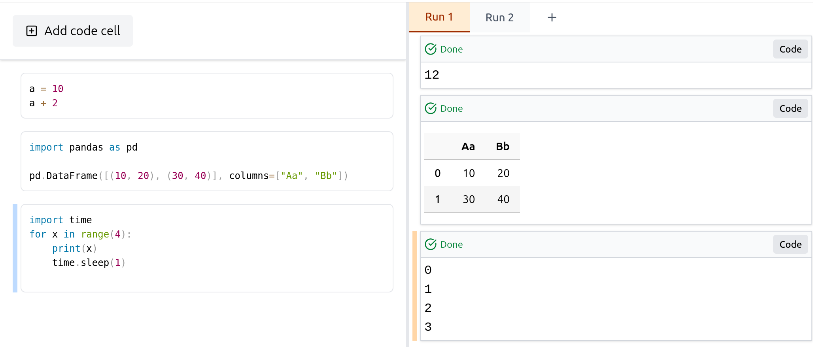

<p align="center">
    
</p>

# TwinSong

TwinSong is an alternative to Jupyter Notebook that separates code and outputs for a cleaner and more efficient workflow.

<p align="center">

</p>

## Features

- **Compact Code** – Code remains uncluttered as outputs are displayed separately.
- **Preserved Results** – Re-evaluating a cell does not overwrite previous results. TwinSong tracks the code that generated past outputs.
- **Multiple Kernel Instances** – The separation of code and outputs allows multiple kernel instances to run over the same code at once.
- **Rust Backend** – The backend is written in Rust. Package is statically linked, no dependencies needed.
- **Clean Python Kernel** - The Python kernel is a clean Python instance with a Rust module that avoids loading additional Python modules or starting additional Python threads.

## Status

TwinSong is currently in an experimental phase. It provides all essential features for evaluating new ideas, including cell creation and code execution. However, many features required for practical usage are still missing. TwinSong now supports only Python Kernel.


## Getting started

Install via `pip`:

```commandline
$ pip install twinsong
```

Start TwinSong itself:

```
twinsong
```

## Building locally

```

# Building frontend

cd browser/ui
npm install
./build.sh
cd ../..

# Building Python module

python3 -m venv venv
source venv/bin/activate
pip install maturin
cd pytwinsong
maturin develop -r

# Building standalone server
# (This is optional; python package already contains server)

cargo build --release --package twinsong
```

## Roadmap

* ~~Python kernel~~ (released)
* ~~Basic UI~~ (released)
* ~~Cell evaluation~~ (released)
* ~~Stdout streaming~~ (released)
    * stderr streaming
* ~~Loading/Saving notebook~~ (main branch)
    * autosave
    * directory changing
* Object inspection
* Stopping kernels & cell evaluations
* Closing runs & notebooks
* Automatical code reloading
* Modal code editor (?)
* More keyboard shortcuts
* Making sure that important packages are running with nice outputs:
    * ~~pandas~~
    * tqdm
    * plotly


## License

Licensed under either of

- Apache License, Version 2.0 ([LICENSE-APACHE](LICENSE-APACHE) or <http://www.apache.org/licenses/LICENSE-2.0>)
- MIT license ([LICENSE-MIT](LICENSE-MIT) or <http://opensource.org/licenses/MIT>)

at your option.
