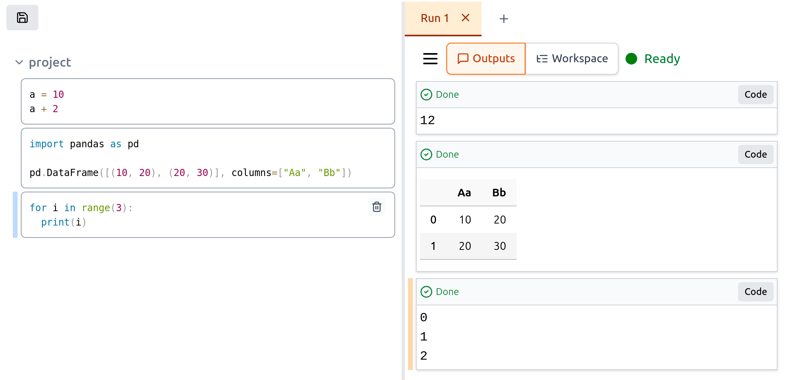

<p align="center">
    
</p>

# TwinSong

Twinsong is an alternative to Jupyter notebooks. It reimagines interactive programming by moving away from the linear "document-style" execution of Jupyter notebooks. Twinsong provides a flexible coding environment where code and outputs are separated. Twinsong also enables better memory state inspection and multi-kernel execution over the same notebook.

## Key Features

### Separated Code & Outputs

<p align="center">

</p>

- **Clean Code View**: Code remains uncluttered as outputs are displayed separately
- **Preserved Results History**: Re-evaluating a cell does not overwrite previous results - Twinsong tracks which code generated past outputs
- **Multi-kernel Support**: Run multiple kernel instances over the same code simultaneously
- **Execution History**: Twinsong preserves the history of cell evaluations

### Tree-structured Code Organization

<p align="center">

</p>

- **Hierarchical Code**: Organize your code in a tree structure rather than linear cells
- **Batch Execution**: Evaluate entire subtrees at once with a single command
- **Scoped Memory Spaces**: Define hierarchical scopes - subtrees can have their own memory space

### Variable Inspection

<p align="center">

</p>

- **Memory Exploration**: Examine global variables and their structure
- **Type Information**: View detailed type information for complex data structures
- **Hierarchical Display**: Navigate nested data structures in an intuitive interface


### Git-friendly Notebook Format
- **Separate Storage**: Code, runs, and user settings are stored separately
- **Avoid Merge Conflicts**: Prevent conflicts that arise just from cell evaluation
- **Selective Versioning**: Version code alone or include specific runs

### Powerful Backend
- **Rust Implementation**: Core is written in Rust for performance and reliability
- **No Dependencies**: Package is statically linked with no external dependencies
- **Clean Python Kernel**: Kernel uses a clean Python instance just with a Rust module, avoiding loading unnecessary Python modules or starting additional Python threads


## Status

TwinSong is currently in an experimental phase. It provides all essential features for evaluating new ideas, including cell creation and code execution. However, many features required for practical usage are still missing. TwinSong now supports only Python Kernel.


## Getting started

Install via `pip`:

```commandline
$ pip install twinsong
```

Start TwinSong itself:

```
twinsong
```

## Current Limitations

Twinsong is currently in an experimental phase with some limitations:

- Backward compatibility of notebook formats is not yet guaranteed
- Some libraries (like Plotly and Matplotlib) don't display visualizations correctly yet
- Limited keyboard shortcuts compared to mature environments
- Only Python kernel is currently supported

## Project Status

Development is currently concentrated on core functionality and stability. The roadmap includes:

- Import/export with Jupyter notebook format
- Support commonly used modules used in Jupyter
- Enhanced debugging capabilities
- Additional keyboard shortcuts and productivity features

## Docs

- Blogpost introducing Twinsong: https://spirali.github.io/blog/twinsong/


## Contributing

Issues and contributions are welcome! Please file issues on GitHub if you encounter problems or have suggestions for improvements.


## Building locally

```

# Building frontend

cd browser/ui
npm install
./build.sh
cd ../..

# Building Python module

python3 -m venv venv
source venv/bin/activate
pip install maturin
cd pytwinsong
maturin develop -r

# Building standalone server
# (This is optional; python package already contains server)

cargo build --release --package twinsong
```


## License

Licensed under either of

- Apache License, Version 2.0 ([LICENSE-APACHE](LICENSE-APACHE) or <http://www.apache.org/licenses/LICENSE-2.0>)
- MIT license ([LICENSE-MIT](LICENSE-MIT) or <http://opensource.org/licenses/MIT>)

at your option.
